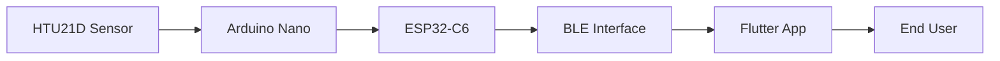
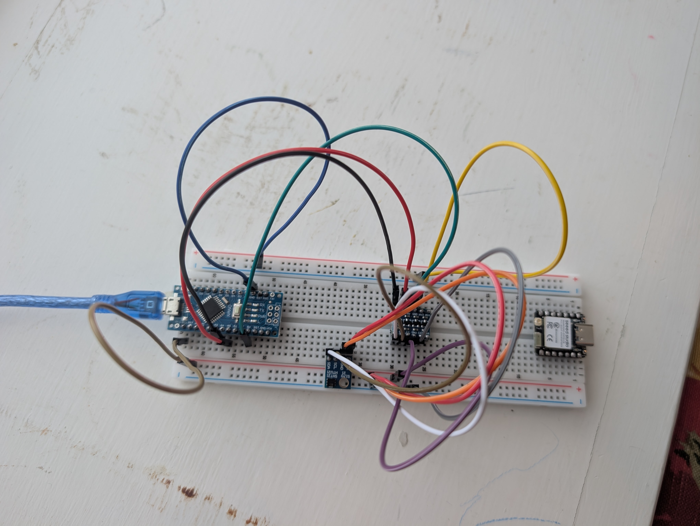
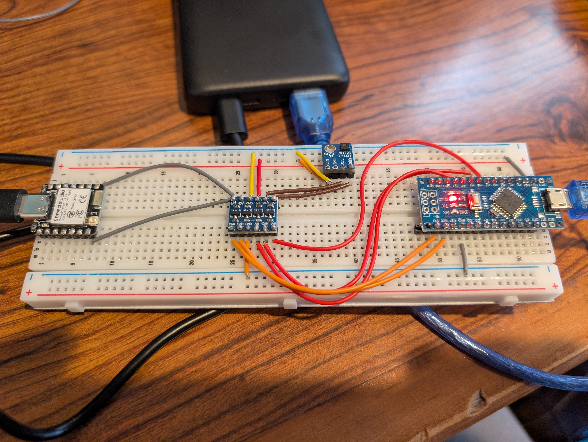

# **StillCold** — Sprint 1 Summary
## Environmental monitoring without opening the door
### Weeks 4–7

---

# Share progress: Where we are after Sprint 1

**Sprint 1 goal (achieved):** Establish a reliable end-to-end data pipeline that measures internal temperature and exposes it via BLE.

- **Full end-to-end pipeline working:** HTU21D sensor → Arduino Nano → ESP32-C6 → BLE → external device.
- **BLE service** on ESP32-C6 exposes temperature and humidity as readable characteristics.
- **Flutter companion app MVP:** Discovers StillCold over BLE, connects, reads live temperature/humidity, dashboard, thresholds, quiet hours, alert history.

*No Wi-Fi or cellular; data stays on-device and over BLE.*

---

# End-to-end data flow (Sprint 1)

Sensor → Nano → ESP32-C6 → BLE → Flutter App → user.

---

# Sprint 1 in four weeks

| Week | Focus | Key outcome |
|------|--------|-------------|
| **4** | Hardware setup and verification | Sensor + Nano + level shifter wired; reliable temperature/humidity; voltage lesson (logic level shifter). |
| **5** | Data acquisition and transfer | Internal pipeline: Nano → UART → ESP32-C6; simple text format; shared ground and pins verified. |
| **6** | BLE service and characteristics | StillCold advertises; custom service; temperature + humidity readable; reconnect lifecycle stable. |
| **7** | End-to-end validation + Flutter | App discovers, connects, shows live data; thresholds, quiet hours, alert history; SRS status tracked. |

---

# Week 4: Hardware foundation

- **Goal:** Solid hardware foundation before wireless or apps.
- **Achieved:** Sensor and Arduino Nano connected and working; temperature and humidity reliable; power stable.
- **Lesson:** Logic level shifter required — sensor at 3.3 V, Nano at 5 V; direct connection produced wrong readings until voltage was corrected.

---

---

# Week 5: Internal data pipeline

- **Goal:** Reliable temperature data moving inside the device, from sensor to the part that would later talk wirelessly.
- **Achieved:** Two roles — Sensing (Nano reads sensor, sends text) and Communication (ESP32-C6 receives, stores, displays). Data format simple (e.g. `T=20.6,H=28.7`).
- **Validated:** Two-board design works; shared ground and pin choices matter for consistent link.

---

# Week 6: BLE integration

- **Goal:** Expose live environmental data over BLE.
- **Achieved:** BLE server advertises as "StillCold"; custom service with temperature and humidity characteristics; real-time sync; advertising restarts after disconnect.
- **Validated:** BLE values match Serial output; multiple connect/disconnect cycles stable; no manual reset needed.

*Pipeline complete: Sensor → Nano → ESP32-C6 → BLE → external device.*

---

# Week 7: Flutter companion app MVP

- **Goal:** Working mobile app: discover, connect, live readings, thresholds, quiet hours, alert history.
- **Achieved:** Onboarding, BLE discovery (StillCold filter), dashboard with temperature/humidity and last-updated, refresh, °C/°F, thresholds, quiet hours, alert history, local storage. SRS status documented.

---

---

# Dashboard: live readings

- Connection status, prominent temperature and humidity, last updated, manual refresh.
- Readings from StillCold over BLE; timestamped and stored locally for history and alerts.

---

---

# Reflect on Sprint 1

**What worked**
- Clear split: sensing vs communication; simple text protocol; BLE lifecycle handled explicitly.
- Early hardware verification (level shifter) prevented wrong data from propagating.
- Weekly milestones kept scope manageable; Flutter app anchored to SRS from the start.

---

**What we corrected or clarified**
- Voltage levels and shared ground (W4–W5); advertising restart after disconnect (W6); pin and upload vs operation workflow (W5).

**Assumptions validated**
- Two-MCU design is practical; BLE can expose live sensor data reliably; simple string characteristics are sufficient; app can run on device and talk to real hardware.

---

---

# Getting ready for deployment

**Deployment plan:** Present the project at the **NKU Celebration of Student Research and Creativity on April 23**.

**Readiness for Sprint 2**
- **Cold-environment validation** — Test in realistic refrigerated conditions; document behavior and limitations.
- **Flutter app–SRS alignment** — Connection lifecycle, polling, stale data indication, core UX.
- **Hardware packaging** — Move off breadboard; explore ESP32-only option (time-boxed); robust assembly for repeated cold use.

*Goal: tested, documented system and an app that aligns with the SRS, ready to demonstrate.*

---

# Sprint 2 schedules and milestones (finalized)

**Duration:** 6 weeks.

| Priority | Scope |
|----------|--------|
| **Must** | Cold-environment testing on current baseline; Flutter app aligned with core SRS (connection lifecycle, polling/staleness); regression and stability checks. |
| **Should** | Move off breadboard (perfboard/PCB); Flutter UX polish (errors, connection status, stale indication). |
| **Stretch** | Full Nano removal (ESP32-only); advanced app features (charts, multi-day summaries). |

**Week themes:** W1 stabilize and plan; W2 cold-environment test pass; W3 Flutter core gaps; W4 ESP32-only spike (go/no-go); W5 packaging + app polish; W6 regression and final artifacts.

---

# What / How I've learned with AI

**AI as a "second brain"** — Used *with* the learner: offload context, ask better questions, work through uncertainty. Not a replacement for thinking.

**Two learning topics in StillCold**
1. **Sensors and data acquisition** — How physical measurements become digital data; resolution, timing, limitations. AI helped interpret datasheets and relate theory to observed behavior.
2. **Applications as system interfaces** — How the app talks to hardware over BLE; patterns, constraints, design choices. AI helped reason about the app as part of the whole system.

---

**What AI did:** Helped ask "why" before "how"; unpack terminology; reason about architecture and BLE lifecycle.

**What AI did not do:** Wire the breadboard, fix pin assignments, or replace testing. Understanding came from building and testing; AI supported how I think.

---

# Thank you

**StillCold** — *Environmental monitoring without opening the door*

Questions?
