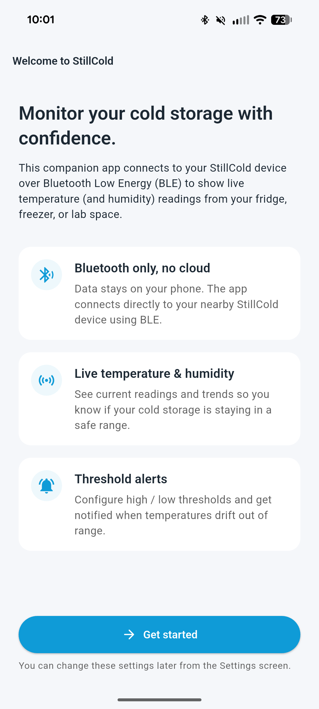
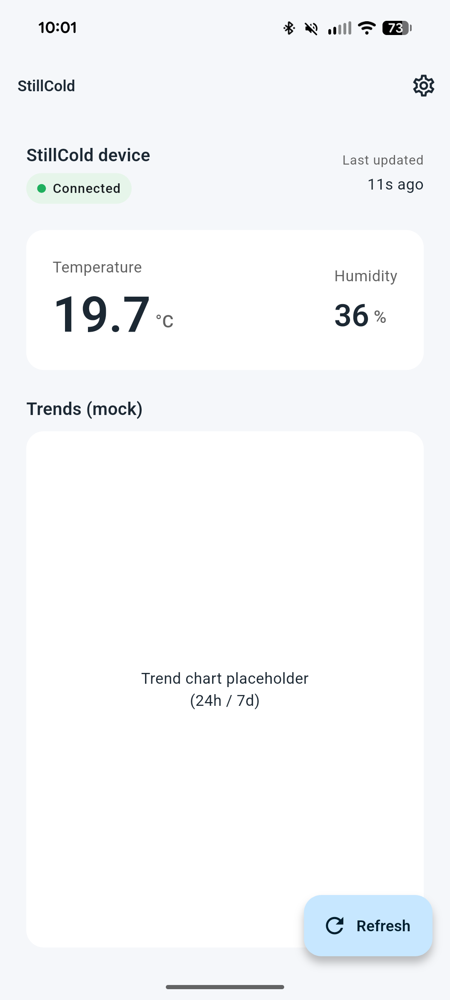
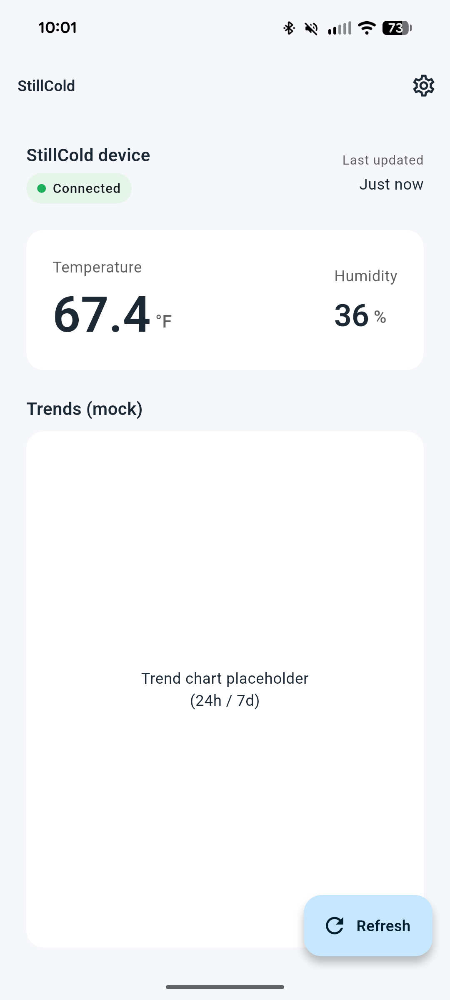

# **StillCold** — Week 7 Progress  
## Flutter Companion App MVP

*Building the mobile side of the StillCold system*

---

# What Week 7 Was About

**Goal:** Move from BLE‑only hardware validation to a working **Flutter companion app** that:

- Discovers **StillCold** devices over BLE.
- Connects and reads **live temperature and humidity**.
- Shows readings in a **modern, user‑friendly UI**.
- Implements **threshold alerts, quiet hours, and alert history**.
- Begins aligning the implementation to the **formal SRS**.

---

# First‑Run Experience

The app now has an **Onboarding screen** that introduces the companion app and sets expectations:

- Explains that the app uses **Bluetooth Low Energy (BLE)**, not the cloud.
- Emphasizes **live temperature & humidity monitoring**.
- Highlights **threshold alerts** as a core feature.
- Guides the user to **Get started** and proceed to discovery.

---

---

# Device Discovery Over BLE

The app now acts as a **Bluetooth “radar”** for nearby StillCold devices:

- Scans for nearby devices and only shows those named **"StillCold"**.
- Clearly explains what’s happening while scanning.
- Gives simple, human‑readable messages if:
  - No devices are found.
  - The phone is missing a required permission.
  - Something goes wrong during the scan.
- Shows **signal strength** for each device, so you know which one is closest.
- Remembers which device you used last, and surfaces that in the discovery view.

From here, a single tap takes you into the **Dashboard** for that device.

---

# Dashboard: Live Readings

The **Dashboard** presents the core environmental data:

- **Connection status** chip (connected).
- Prominent **temperature** card with one decimal precision.
- **Humidity** percentage.
- **Last updated** indicator (e.g., “Just now”, “11s ago”).
- **Refresh** button to manually request a new reading.

Each reading:

- Comes directly from the StillCold device over Bluetooth.
- Is tagged with **when** it was taken.
- Is saved on the phone so that history and alerts can be reviewed later.

---

---

# Temperature Units: °C / °F

The app supports user preference for **Celsius or Fahrenheit**:

- **Settings** screen exposes a **“Use Fahrenheit”** toggle.
- The Dashboard:
  - Converts temperature as needed.
  - Updates both value **and unit label** consistently.
- Humidity display remains unchanged.

---

---

# Thresholds, Quiet Hours, and Alerts

On top of raw readings, the app now helps answer the question:  
**"Is my cold storage staying within a safe range?"**

- **Custom thresholds**  
  - Set your own safe **low** and **high** temperature limits.
  - Defaults are chosen to match typical refrigeration guidance.

- **Quiet hours**  
  - Optional "do not disturb" window (for nights or meetings).
  - Alerts are silently logged during this time without buzzing your phone.

---
- **Alert history**  
  - A simple timeline showing **when things went out of range**, and by how much.
  - Lets you see patterns (e.g., "door left open every evening around 6pm").

- **On‑device notifications**  
  - When the temperature crosses your thresholds (and you're not in quiet hours),
    the phone shows a clear notification so you can act quickly.

---

# Data and Privacy: Where Information Lives

All companion‑app data **stays on the phone**:

- Temperature and humidity readings are stored locally for history and future charts.
- Your preferences (units, thresholds, quiet hours, last device) are also stored locally.
- Alert history never leaves the device.

There is:

- **No cloud backend.**
- **No internet requirement.**

If your phone can talk to the StillCold device over Bluetooth, you get full functionality today, and the design leaves room to grow with charts, multi-device support, and more.

---

# Alignment with the SRS

A dedicated document, `SRS_status_week7.md`, now tracks **requirement status**:

- **Most Sprint 1 Must‑have FRs** are implemented:
  - BLE discovery and connection.
  - Live temperature/humidity display.
  - Manual refresh + timestamped readings.
  - Local, on‑device storage of readings and alerts.
  - Threshold configuration + alerts + quiet hours + alert history.
  - Unit toggling and basic UX/error states.
- Non‑functional goals around **usability, maintainability, and Android compatibility** are largely met.
This document provides a clear **traceability map** from SRS → codebase → current behavior.

---

# What’s Still Missing (High Level)

From the SRS and status review:

- **Connection lifecycle polish**
  - Real‑time connection state (connecting / connected / disconnected).
  - Explicit **Disconnect** action that returns to Discovery.
  - A dedicated **“Connection lost”** flow when BLE drops unexpectedly.

---
- **Sprint 2 enhancements**
  - Periodic **polling loop** tied to the configured interval.
  - Real **trend charts** (24h / 7d) using stored readings.
  - **Min/max summaries** (e.g., coldest/warmest last 24h).
  - **Dashboard RSSI** when connected.
  - **Device label editing UI** (add/rename/remove).
  - Visual indication when readings become **stale**.

These are the main targets for the next iteration.

---

# Week 7 Summary

- The **StillCold Flutter companion app runs on real hardware** (Pixel 8) and:
  - Discovers the StillCold device over BLE.
  - Reads and displays live temperature and humidity.
  - Stores readings on the phone with timestamps.
  - Evaluates thresholds and surfaces alerts (including local notifications and history).
  - Lets the user configure units, thresholds, quiet hours, and basic device preferences.
- The implementation is now **firmly anchored to the SRS**, with an explicit status document for verification.

The project has effectively moved from **“BLE‑capable hardware”** to a **working end‑to‑end system** with a mobile UI.

---

# Thank you

**StillCold** — *Environmental monitoring without opening the door*

Questions?

