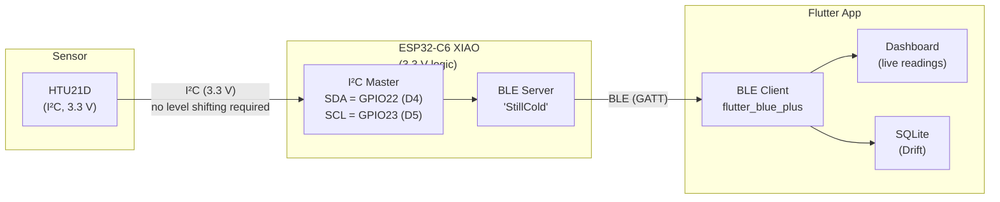

# StillCold — Single-MCU Architecture (Sprint 2 Consolidated)

> Reflects the consolidated design validated in Sprint 2 Week 3/4. Supersedes `architecture_sprint2_week1.md` (two-MCU baseline).
> The Arduino Nano, logic level shifter, and UART pipeline have been eliminated. The ESP32-C6 now reads the HTU21D directly over I²C.

---

## System Overview

---

## What Changed from the Two-MCU Baseline

| Removed | Reason |
|---------|--------|
| Arduino Nano (5 V) | ESP32-C6 absorbs sensor-polling role entirely |
| Bi-directional logic level shifter | Eliminated — HTU21D and ESP32-C6 are both 3.3 V natively |
| UART wiring (TX/RX + shared GND across boards) | No longer needed — sensor is on the same board |
| `Serial1` UART receive logic | Replaced by direct `Wire`/I²C reads |
| `sscanf` string parser (`T=…,H=…` framing) | Replaced by direct `float` → `String` conversion |
| `incoming` string buffer | Not needed |
| `isnan()`-only error guard | Replaced by `>= 998` check (catches library error codes 998/999) |

---

## Component Responsibilities

| Component | Role | Key constraints |
|-----------|------|-----------------|
| **HTU21D sensor** | Measures temperature and humidity | I²C at 3.3 V; address `0x40`; ~50 ms conversion time |
| **ESP32-C6 (XIAO)** | Reads HTU21D over I²C; hosts BLE GATT server; re-advertises on disconnect | 3.3 V logic; single board; powered via USB |
| **BLE GATT server** | Exposes temperature and humidity as readable characteristics | Advertises as `StillCold`; restarts advertising after disconnect |
| **Flutter app** | User interface: discover, connect, read, alert, store | BLE client; SQLite (Drift); local notifications |

---

## Wiring

| HTU21D Pin | ESP32-C6 XIAO Pin | GPIO |
|------------|-------------------|------|
| VIN (VCC) | 3V3 | — |
| GND | GND | — |
| SDA | D4 | GPIO22 |
| SCL | D5 | GPIO23 |

No level shifter. No shared ground across boards. Four wires total.

---

## I²C Configuration

| Parameter | Value |
|-----------|-------|
| Library | SparkFun HTU21D (`SparkFunHTU21D.h`) |
| SDA pin | GPIO22 (D4) |
| SCL pin | GPIO23 (D5) |
| Pin assignment method | `Wire.setPins(SDA_PIN, SCL_PIN)` before `mySensor.begin(Wire)` |
| Polling interval | 2000 ms (`delay(2000)` in `loop()`) |
| Error codes | Library returns `998` (I²C timeout) or `999` (bad CRC) as float values |
| Error guard | `temperature >= 998 \|\| humidity >= 998 \|\| isnan(...)` |

> `Wire.setPins()` is used instead of `Wire.begin(SDA, SCL)` because the SparkFun HTU21D library calls `Wire.begin()` internally with no arguments inside its own `begin()`. `Wire.setPins()` stores the pin values without initializing the bus, so they are picked up correctly when the library initializes.

---

## BLE GATT Service and Characteristics

| Element | Value |
|---------|-------|
| Device name (advertised) | `StillCold` |
| Service UUID | `12345678-1234-1234-1234-1234567890ab` |
| Temperature characteristic UUID | `abcd1234-5678-1234-5678-abcdef123456` |
| Humidity characteristic UUID | `abcd5678-1234-5678-1234-abcdef654321` |
| Data format (temperature) | ASCII string, 2 decimal places, e.g. `"23.54"` |
| Data format (humidity) | ASCII string, 2 decimal places, e.g. `"60.09"` |
| Access | Read-only (polling) |
| Advertising restart | Automatic in `onDisconnect` callback |

The Flutter companion app requires no changes — service UUID, characteristic UUIDs, and value format are identical to the Sprint 1 / two-MCU baseline.

---

## Power

| Rail | Source | Used by |
|------|--------|---------|
| 5 V USB | USB power bank / wall adapter | ESP32-C6 XIAO (onboard regulator steps down to 3.3 V) |
| 3.3 V (from ESP32-C6 onboard regulator) | ESP32-C6 3V3 pin | HTU21D sensor |

Single power source. No separate 5 V rail needed for a second board.

---

## Active Sketch

| Sketch | Location | Status |
|--------|----------|--------|
| `stillcold_esp32_only.ino` | `Arduino/stillcold_esp32_only/` | Active — single-MCU production sketch |
| `stillcold_sensing_node.ino` | `Arduino/archive/` | Archived — Sprint 1 Nano sketch (rollback reference) |
| `stillcold_comm_node.ino` | `Arduino/archive/` | Archived — Sprint 1 ESP32 UART-receive sketch (rollback reference) |

---

## Rollback

If the single-MCU design needs to be reverted:

1. Flash `stillcold_sensing_node.ino` onto the Arduino Nano.
2. Flash `stillcold_comm_node.ino` onto the ESP32-C6.
3. Reconnect the level shifter and UART wiring per `architecture_sprint2_week1.md`.
4. Confirm end-to-end behavior is restored before resuming further work.
