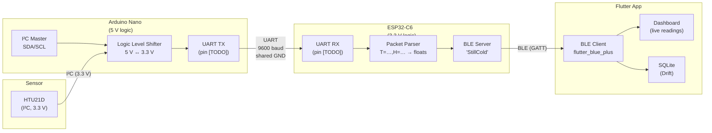

# StillCold — Two-MCU Architecture (Sprint 2 Week 1 Baseline)

> Captured at the start of Sprint 2 as the stable baseline before any consolidation work.
> Pin numbers marked `[TODO]` should be filled in from the actual wiring.

---

## System Overview

---

## Component Responsibilities

| Component | Role | Key constraints |
|-----------|------|-----------------|
| **HTU21D sensor** | Measures temperature and humidity | I²C at 3.3 V; address `0x40`; ~50 ms conversion time |
| **Logic level shifter** | Bridges 5 V (Nano I²C) ↔ 3.3 V (sensor) | Bi-directional; required to avoid wrong readings |
| **Arduino Nano** | Sensor host: polls HTU21D, formats data, sends over UART | 5 V logic; I²C master; sends on a fixed interval |
| **ESP32-C6** | Communication host: receives UART data, hosts BLE GATT server | 3.3 V logic; UART RX only (no TX needed from ESP to Nano currently) |
| **BLE GATT server** | Exposes temperature and humidity as readable characteristics | Advertises as `StillCold`; restarts advertising after disconnect |
| **Flutter app** | User interface: discover, connect, read, alert, store | BLE client; SQLite (Drift); local notifications |

---

## Nano ↔ ESP32-C6 UART Protocol

| Parameter | Value |
|-----------|-------|
| Baud rate | 9600 |
| Framing | Newline-terminated (`\n`) |
| Format | `T=<float>,H=<float>` |
| Example | `T=20.6,H=28.7` |
| Direction | Nano TX → ESP32-C6 RX only |
| Shared ground | Required; confirmed in Sprint 1 |
| Pins | Nano TX: `[TODO]` / ESP32-C6 RX: `[TODO]` |

**Parsing on ESP32-C6:** Split on `,`; extract value after `=`; cast to float. Invalid lines are discarded silently.

---

## BLE GATT Service and Characteristics

| Element | Value |
|---------|-------|
| Device name (advertised) | `StillCold` |
| Service UUID | `[TODO — from BleConfig in firmware]` |
| Temperature characteristic UUID | `[TODO — from BleConfig in firmware]` |
| Humidity characteristic UUID | `[TODO — from BleConfig in firmware]` |
| Data format (temperature) | ASCII string, e.g. `"21.4"` |
| Data format (humidity) | ASCII string, e.g. `"34.2"` |
| Access | Read-only (polling); BLE notify deferred to Sprint 2 stretch |
| Advertising restart | Automatic after client disconnect (confirmed Sprint 1) |

---

## Power

| Rail | Source | Used by |
|------|--------|---------|
| 5 V USB | USB power bank / wall adapter | Arduino Nano, level shifter HV side |
| 3.3 V (from Nano regulator) | Nano onboard 3.3 V pin | HTU21D sensor |
| 3.3 V (onboard) | ESP32-C6 dev board regulator | ESP32-C6 logic |

> Sprint 2 approach: reduce form factor with a smaller 5 V source when moving off breadboard. Integrated battery deferred post-Week 4 decision.

---

## Open Items / Placeholders

- [ ] Fill in Nano TX and ESP32-C6 RX pin numbers
- [ ] Confirm BLE service and characteristic UUIDs from firmware `BleConfig`
- [ ] Document polling interval used on the Nano (how often it reads the sensor)
- [ ] Confirm baud rate (9600 assumed from Sprint 1 docs)
