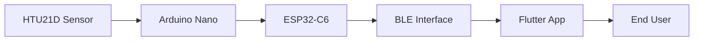
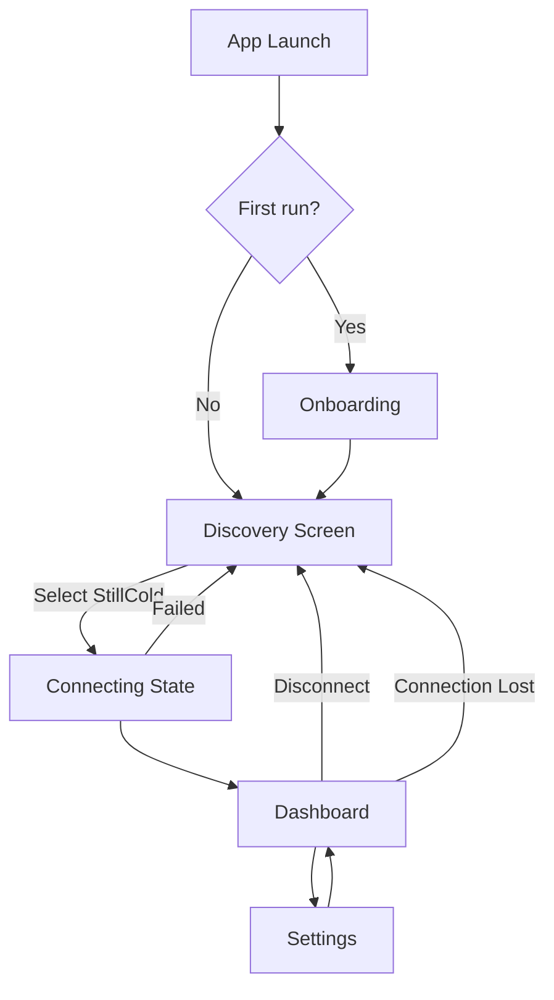

# StillCold Flutter Companion Application — Software Requirements Specification

## Document Purpose and Scope

This SRS defines the functional and non-functional requirements for the StillCold Flutter companion application. The app serves as the primary interface between end-users and the StillCold IoT prototype, enabling wireless monitoring of temperature (and humidity) in refrigerated or enclosed spaces via Bluetooth Low Energy (BLE).

**In-scope:**

- BLE-based communication with StillCold hardware
- Cross-platform mobile application (iOS, Android) built with Flutter
- Features aligned with Sprint 1 and Sprint 2 goals from [README](../../README.md)

**Out-of-scope:**

- Wi-Fi, cellular, or cloud connectivity
- Direct hardware control or firmware updates

---

## 1. Introduction

### 1.1 Purpose

Define the requirements for the StillCold companion app so that development, testing, and stakeholders share a clear understanding of intended behavior, constraints, and success criteria.

### 1.2 Definitions and Acronyms

- **BLE** — Bluetooth Low Energy
- **Characteristic** — BLE attribute that exposes sensor data (temperature, humidity)
- **StillCold** — The IoT prototype (ESP32-C6 + Arduino Nano + HTU21D sensor)

### 1.3 References

- [StillCold README](../../README.md) — Project overview, features, data model
- [Week 6 Plan](../../week_6_plan.md) — BLE service/characteristic behavior
- [Learning with AI Overview](learning_with_ai_overview.md) — Application-as-interface context

---

## 2. Overall Description

### 2.1 Product Perspective

The app is one component in the StillCold system:

The app does not store sensor data on a server or require internet. It communicates only with nearby StillCold hardware over BLE.

### 2.2 User Characteristics

- **Primary users:** Individuals monitoring refrigerated or enclosed spaces (home refrigerators, labs, food storage)
- **Technical level:** May be non-technical; UI must be self-explanatory
- **Context:** Often in the same physical space as the StillCold device (BLE range)

### 2.3 Constraints

- **BLE-only:** No fallback connectivity; data is available only when in range and connected
- **Short-range:** Typical BLE range ~10–30 m; user must be near the monitored environment
- **Data freshness:** Values are read on request or via periodic polling; no push from hardware until BLE notify is implemented (Sprint 2 stretch)
- **StillCold power:** StillCold uses its own power source (e.g., portable USB power bank), allowing it to remain operational when the refrigeration unit loses power

---

## 3. Functional Requirements

### 3.1 Device Discovery and Connection

| ID     | Requirement                                                                                                                                 | Priority |
| ------ | ------------------------------------------------------------------------------------------------------------------------------------------- | -------- |
| FR-1.1 | The app shall scan for BLE devices and identify StillCold by device name (`StillCold`).                                                     | Must     |
| FR-1.2 | The app shall allow the user to select a StillCold device from the scan results and initiate a connection.                                  | Must     |
| FR-1.3 | The app shall display connection status (disconnected, connecting, connected) to the user.                                                  | Must     |
| FR-1.4 | The app shall allow the user to disconnect from the device and return to discovery.                                                         | Must     |
| FR-1.5 | The app shall handle connection loss gracefully and inform the user when the connection is lost.                                            | Must     |
| FR-1.6 | The app shall remember the last connected StillCold device and offer to auto-connect when it is found in range.                             | Should   |
| FR-1.7 | The app shall display RSSI (signal strength) when connected, giving users feedback on connection quality.                                   | Should   |
| FR-1.8 | The app shall allow users to assign custom labels to StillCold devices (e.g., "Kitchen fridge", "Garage freezer") for multi-device support. | Should   |

### 3.2 Sensor Data Display

| ID     | Requirement                                                                                                                 | Priority |
| ------ | --------------------------------------------------------------------------------------------------------------------------- | -------- |
| FR-2.1 | The app shall read the temperature characteristic from the StillCold BLE service and display the current temperature value. | Must     |
| FR-2.2 | The app shall display temperature in Celsius with appropriate precision (e.g., one decimal place).                          | Must     |
| FR-2.3 | The app shall display humidity when the StillCold hardware exposes a humidity characteristic (Sprint 2).                    | Should   |
| FR-2.4 | The app shall provide a manual refresh control to request an updated reading.                                               | Must     |
| FR-2.5 | The app shall periodically poll for updated readings when connected (configurable interval, e.g., every 5–30 seconds).      | Should   |
| FR-2.6 | The app shall attach a client-side timestamp to each reading when it is received.                                           | Must     |
| FR-2.7 | The app shall display a prominent "last updated" indicator (e.g., "Updated 30 seconds ago") for the current reading.        | Must     |

### 3.3 Data Storage and History

| ID     | Requirement                                                                                                            | Priority |
| ------ | ---------------------------------------------------------------------------------------------------------------------- | -------- |
| FR-3.5 | The app shall store timestamped temperature (and humidity) readings in a local SQLite database.                        | Must     |
| FR-3.6 | The app shall display a simple trend chart of temperature and humidity over selectable time ranges (last 24h, 7 days). | Should   |
| FR-3.7 | The app shall display min/max summary for a period (e.g., coldest and warmest readings in last 24h).                   | Should   |

### 3.4 Threshold Alerts

| ID     | Requirement                                                                                                    | Priority |
| ------ | -------------------------------------------------------------------------------------------------------------- | -------- |
| FR-4.1 | The app shall allow users to set customizable high and low temperature thresholds.                             | Must     |
| FR-4.2 | The app shall trigger in-app and local notifications when temperature crosses a threshold.                     | Must     |
| FR-4.3 | The app shall provide suggested default thresholds (e.g., ≤4°C / 40°F for refrigeration) with brief rationale. | Should   |
| FR-4.4 | The app shall support quiet hours: an option to suppress notifications during user-configured time windows.    | Should   |
| FR-4.5 | The app shall maintain an alert history: a log of when thresholds were crossed and the reading at that time.   | Should   |

### 3.5 User Experience and Feedback

| ID     | Requirement                                                                                                                    | Priority |
| ------ | ------------------------------------------------------------------------------------------------------------------------------ | -------- |
| FR-5.1 | The app shall display clear feedback when Bluetooth is disabled or unavailable.                                                | Must     |
| FR-5.2 | The app shall provide dedicated empty/error states: "No devices found" and "Connection lost" with concise next steps.          | Must     |
| FR-5.3 | The app shall display an indication when the last reading is stale (e.g., older than a threshold).                             | Should   |
| FR-5.4 | The app shall provide guidance or error messages for common failure modes (permission denied, connection failed, read failed). | Must     |
| FR-5.5 | The app shall provide a simple onboarding flow explaining BLE, why permissions are needed, and how to connect the first time.  | Should   |
| FR-5.6 | The app shall allow users to toggle temperature units (Celsius/Fahrenheit) in settings.                                        | Must     |

---

## 4. Non-Functional Requirements

### 4.1 Usability (UI/UX)

| ID      | Requirement                                                                                                               | Notes                 |
| ------- | ------------------------------------------------------------------------------------------------------------------------- | --------------------- |
| NFR-1.1 | The UI shall be intuitive: primary actions (connect, refresh, view readings) shall be discoverable without documentation. | Core design principle |
| NFR-1.2 | The UI shall be clean: minimal visual clutter, clear typography, adequate contrast.                                       | Core design principle |
| NFR-1.3 | The UI shall be simple: avoid unnecessary screens, steps, or configuration.                                               | Core design principle |
| NFR-1.4 | Temperature (and humidity when present) shall be the visual focus when connected.                                         | Primary user goal     |
| NFR-1.5 | The app shall use consistent terminology (e.g., "StillCold" for the device, "Temperature" / "Humidity" for data).         | Consistency           |

### 4.2 Reliability

| ID      | Requirement                                                                                                     |
| ------- | --------------------------------------------------------------------------------------------------------------- |
| NFR-2.1 | The app shall recover from BLE disconnection without requiring a restart.                                       |
| NFR-2.2 | The app shall handle invalid or malformed BLE data gracefully (e.g., display an error state rather than crash). |

### 4.3 Performance

| ID      | Requirement                                                                                                                   |
| ------- | ----------------------------------------------------------------------------------------------------------------------------- |
| NFR-3.1 | The app shall respond to user actions (scan, connect, refresh) within a reasonable time; long operations shall show progress. |
| NFR-3.2 | Polling shall not significantly impact device battery when the app is in use.                                                 |

### 4.4 Compatibility

| ID      | Requirement                                                                                                          |
| ------- | -------------------------------------------------------------------------------------------------------------------- |
| NFR-4.1 | The app shall run on Android and iOS with BLE support.                                                               |
| NFR-4.2 | The app shall request and handle runtime permissions (Bluetooth, location where required for BLE scan) per platform. |

### 4.5 Maintainability

| ID      | Requirement                                                                                                         |
| ------- | ------------------------------------------------------------------------------------------------------------------- |
| NFR-5.1 | BLE service and characteristic UUIDs shall be configurable (e.g., via constants) to accommodate hardware changes.   |
| NFR-5.2 | The app structure shall support incremental addition of features (e.g., alerts, history) without major refactoring. |

---

## 5. User Interface Requirements

### 5.1 Screen Overview

| Screen         | Purpose                       | Key Elements                                                                                              |
| -------------- | ----------------------------- | --------------------------------------------------------------------------------------------------------- |
| **Onboarding** | First-time setup              | BLE explanation, permission rationale, how to connect                                                     |
| **Discovery**  | Scan and connect to StillCold | Scan button, device list (with RSSI), StillCold filter, last-device auto-connect                          |
| **Dashboard**  | View live readings and trends | Temperature, humidity, "last updated", RSSI, connection status, refresh, disconnect, trend chart, min/max |
| **Settings**   | Configuration and preferences | Polling interval, Celsius/Fahrenheit toggle, thresholds, quiet hours, device labels, alert history        |

### 5.2 Navigation Flow

### 5.3 Visual and Interaction Guidelines

- Use a clear hierarchy: connection status at top or prominent; readings large and readable
- Use color sparingly for status (e.g., green = connected, gray = disconnected, amber = stale)
- Provide haptic or visual feedback for key actions (connect, refresh)
- Avoid modal dialogs for routine flows; prefer inline feedback where possible
- Empty and error states ("No devices found", "Connection lost") shall include concise, actionable next steps

---

## 6. External Interfaces

### 6.1 BLE Interface

- **Device name:** `StillCold`
- **Service:** Custom 128-bit UUID (to be defined with embedded implementation)
- **Characteristics:** Temperature (readable), Humidity (readable, Sprint 2)
- **Data format:** Simple string, e.g. `21.4` for temperature; `34.2` for humidity; or combined `T=21.4,H=34.2` if hardware uses single characteristic
- **Update model:** Read-on-request (polling) for MVP; BLE notify as future enhancement

### 6.2 Platform APIs

- Flutter BLE plugin (e.g., `flutter_ble_lib`, `flutter_reactive_ble`, or `flutter_blue_plus`) for BLE operations
- Platform-specific permission handling for Bluetooth and location (Android scan)

### 6.3 Data Storage (SQLite)

- **Schema:** Timestamped readings (temperature, humidity), user settings (thresholds, units, quiet hours, device labels), alert history
- **Scope:** Local only; no cloud sync in prototype
- **Retention:** Configurable or bounded (e.g., last 7–30 days of readings) to manage storage size

---

## 7. Future Enhancements (Out of Prototype Scope)

Captured for completeness; not part of initial SRS acceptance:

- **Push notifications for power loss** — Would require cloud backend; shelved for prototype
- **BLE notify** — Push updates from hardware instead of polling
- **Data export (CSV/JSON)** — Backup or sharing of stored readings
- **Dark/light theme toggle** — User preference

---

## 8. Verification and Traceability

| Requirement Category   | Verification Method                                           |
| ---------------------- | ------------------------------------------------------------- |
| Functional (FR-*)      | Manual testing, BLE integration tests                         |
| Non-functional (NFR-*) | Usability review, performance profiling, compatibility matrix |
| UI/UX                  | Design review, heuristic evaluation                           |

Traceability to project milestones:

- **Sprint 1:** FR-1.1–1.5, FR-2.1, FR-2.2, FR-2.4, FR-2.6, FR-2.7, FR-3.5, FR-4.1, FR-4.2, FR-5.1, FR-5.2, FR-5.4, FR-5.6, NFR-1.*, NFR-2.*, NFR-4.*
- **Sprint 2:** FR-1.6, FR-1.7, FR-2.3, FR-2.5, FR-3.6, FR-3.7, FR-4.3, FR-4.4, FR-4.5, FR-5.3, FR-5.5, FR-1.8 (multi-device), NFR-3.*, NFR-5.*

---

## Summary

This SRS provides a structured set of requirements for the StillCold Flutter companion app, aligned with the existing hardware and project goals. The emphasis on intuitive, clean, and simple UI/UX is reflected in NFR-1.* and the screen/navigation design.

End-user features include:

- Reliable BLE discovery, connection (with auto-reconnect and RSSI), and live temperature/humidity display
- Client-side timestamping and prominent "last updated" indicator
- SQLite-backed storage for readings, trend charts (24h, 7 days), and min/max summaries
- Customizable threshold alerts with suggested defaults, quiet hours, and alert history
- Named devices for multi-unit support, Celsius/Fahrenheit toggle
- Simple onboarding and clear empty/error states with actionable guidance
